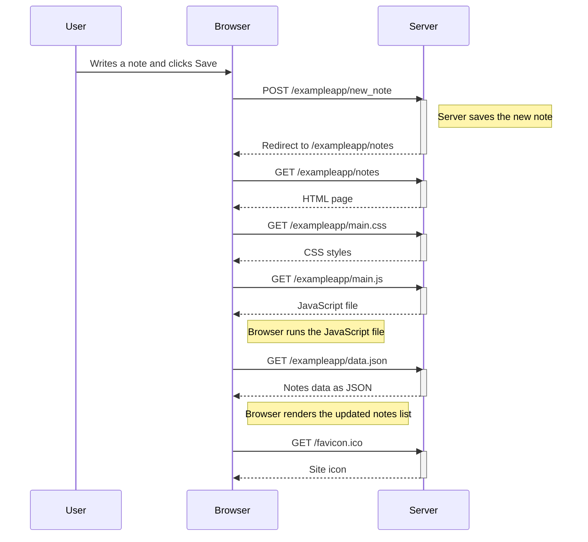

```mermaid
sequenceDiagram
    participant User
    participant Browser
    participant Server

    User->>Browser: Writes a note and clicks Save

    Browser->>Server: POST /exampleapp/new_note
    activate Server
    Note right of Server: Server saves the new note
    Server-->>Browser: Redirect to /exampleapp/notes
    deactivate Server

    Browser->>Server: GET /exampleapp/notes
    activate Server
    Server-->>Browser: HTML page
    deactivate Server

    Browser->>Server: GET /exampleapp/main.css
    activate Server
    Server-->>Browser: CSS styles
    deactivate Server

    Browser->>Server: GET /exampleapp/main.js
    activate Server
    Server-->>Browser: JavaScript file
    deactivate Server

    Note right of Browser: Browser runs the JavaScript file

    Browser->>Server: GET /exampleapp/data.json
    activate Server
    Server-->>Browser: Notes data as JSON
    deactivate Server

    Note right of Browser: Browser renders the updated notes list

    Browser->>Server: GET /favicon.ico
    activate Server
    Server-->>Browser: Site icon
    deactivate Server
```
