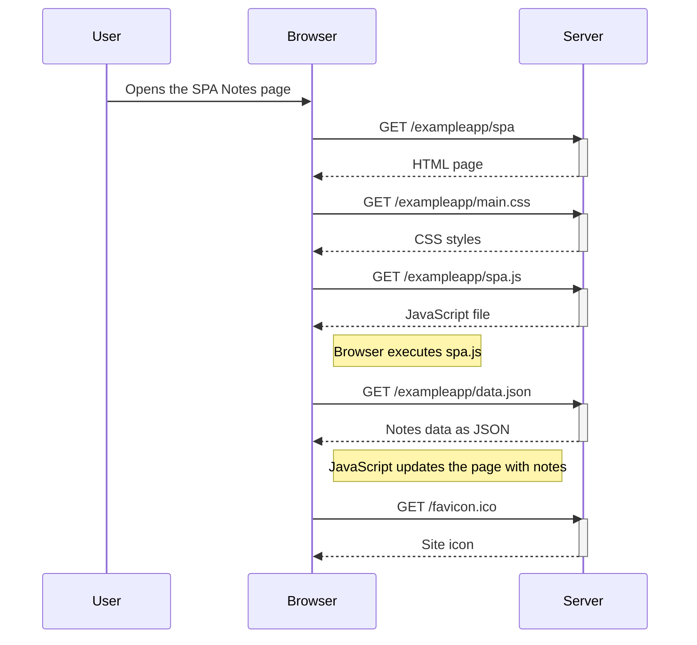

```mermaid
sequenceDiagram
    participant User
    participant Browser
    participant Server

    User->>Browser: Opens the SPA Notes page

    Browser->>Server: GET /exampleapp/spa
    activate Server
    Server-->>Browser: HTML page
    deactivate Server

    Browser->>Server: GET /exampleapp/main.css
    activate Server
    Server-->>Browser: CSS styles
    deactivate Server

    Browser->>Server: GET /exampleapp/spa.js
    activate Server
    Server-->>Browser: JavaScript file
    deactivate Server

    Note right of Browser: Browser executes spa.js

    Browser->>Server: GET /exampleapp/data.json
    activate Server
    Server-->>Browser: Notes data as JSON
    deactivate Server

    Note right of Browser: JavaScript updates the page with notes

    Browser->>Server: GET /favicon.ico
    activate Server
    Server-->>Browser: Site icon
    deactivate Server
```
