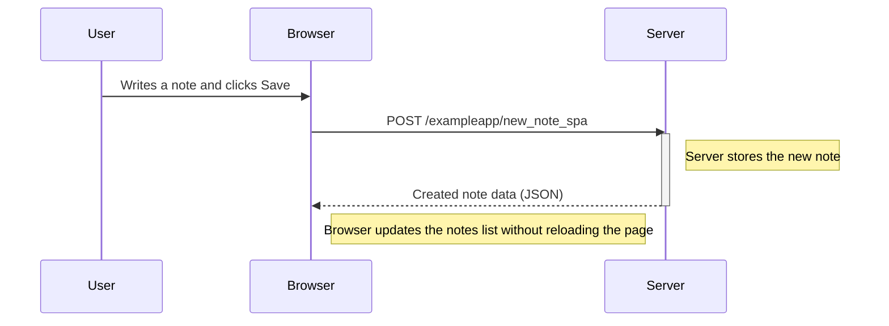

```mermaid
sequenceDiagram
    participant User
    participant Browser
    participant Server

    User->>Browser: Writes a note and clicks Save

    Browser->>Server: POST /exampleapp/new_note_spa
    activate Server
    Note right of Server: Server stores the new note
    Server-->>Browser: Created note data (JSON)
    deactivate Server

    Note right of Browser: Browser updates the notes list without reloading the page
```
